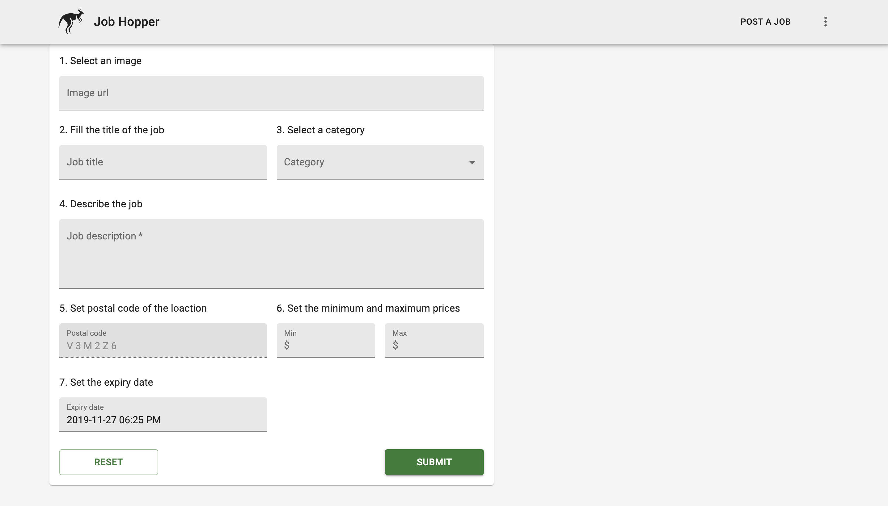
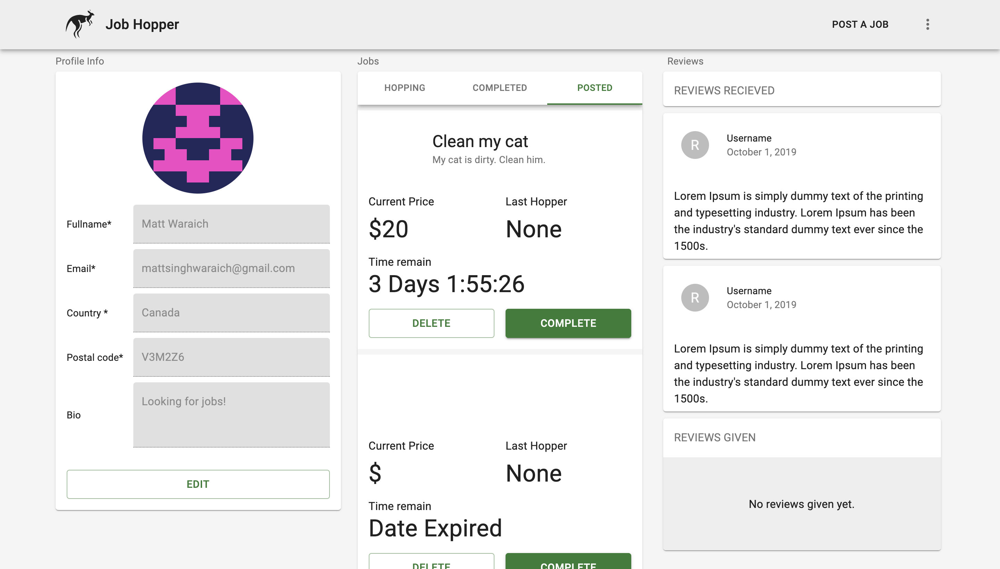
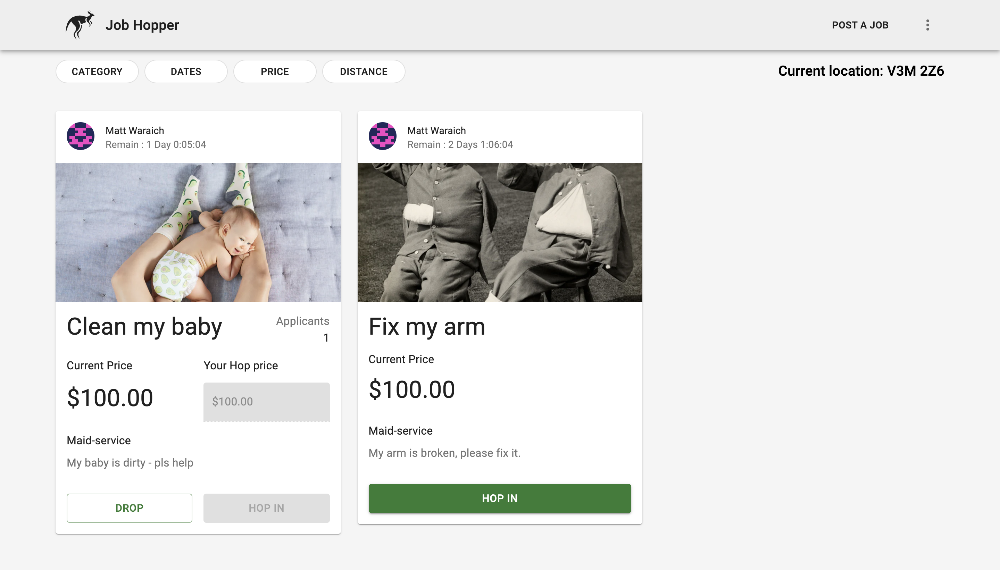

# JobHopper

- JobHopper is a hybrid app that offers the user the ability to pick up odd jobs in their local areas for quick and easy cash! JobHopper allows the user to navigate through the app in a systematic order to place, remove, and create bids for jobs that seem fit to their liking.
- JobHopper grants users the ability to sign up and view available jobs of various categories.
- JobHopper also allows clients to post their job and its details on the app in hopes of receiving the best possible price for their recently posted job(s).
- JobHopper allows the user to view his/her profile, as well as others,and even edit their bio in order to attract future opportunities!

## Technologies Used

- Meteor
- React
- Final Forms
- React Router
- NPM
- Mongo Database
- Material UI

## Physical Data Model


## Installation Instructions

- 'yarn install'
  Will install all dependencies required for the app.

- 'yarn run:dev'
  Runs the app in the development mode.
  Open http://localhost:3000 to view it in the browser.

The page will reload if you make edits.
You will also see any lint errors in the console.

## User Interface of JobHopper App









## Personal Learnings

### Mongo Database:

MongoDB is a cross-platform document-oriented database program. Classified as a NoSQL database program, MongoDB uses JSON-like documents with schema. A document-based open source database, that provides you scalability and flexibility.

#### Installing MongoDB:

```
$ brew install mongodb
```

Having MongoDB installed, you need to create the directory where you’re going to store the data.

```
$ mkdir -p /data/db
```

To execute MongoDB as a service:

```
$ brew services start mongodb
```

The next step is creating our database that we call it: jobs.

```
$ mongo
> use jobs
```

### Meteor

Meteor, or MeteorJS, is a free and open-source isomorphic JavaScript web framework written using Node.js. Meteor allows for rapid prototyping and produces cross-platform (Android, iOS, Web) code. It integrates with MongoDB and uses the Distributed Data Protocol and a publish–subscribe pattern to automatically propagate data changes to clients without requiring the developer to write any synchronization code. On the client, Meteor can be used with its own Blaze templating engine, as well as with the Angular or React frameworks.

Meteor is a full-stack JavaScript platform for developing modern web and mobile applications. Meteor includes a key set of technologies for building connected-client reactive applications, a build tool, and a curated set of packages from the Node.js and general JavaScript community.

- Meteor allows you to develop in one language, JavaScript, in all environments: application server, web browser, and mobile device.

- Meteor uses data on the wire, meaning the server sends data, not HTML, and the client renders it.

- Meteor embraces the ecosystem, bringing the best parts of the extremely active JavaScript community to you in a careful and considered way.

- Meteor provides full stack reactivity, allowing your UI to seamlessly reflect the true state of the world with minimal development effort.

On OS X or Linux, Install the latest official Meteor release from your terminal:

```
curl https://install.meteor.com/ | sh

```

Once you’ve installed Meteor, create a project:

```
meteor create myapp
```

Run it locally:

```
cd myapp
meteor npm install
meteor
# Meteor server running on: http://localhost:3000/
```

&nbsp;

---

&nbsp;

## License

- Structural code is open-sourced under the [MIT license](/LICENSE.md).
  &nbsp;

- Learning materials content is copyright (c) 2019 RED Academy.
