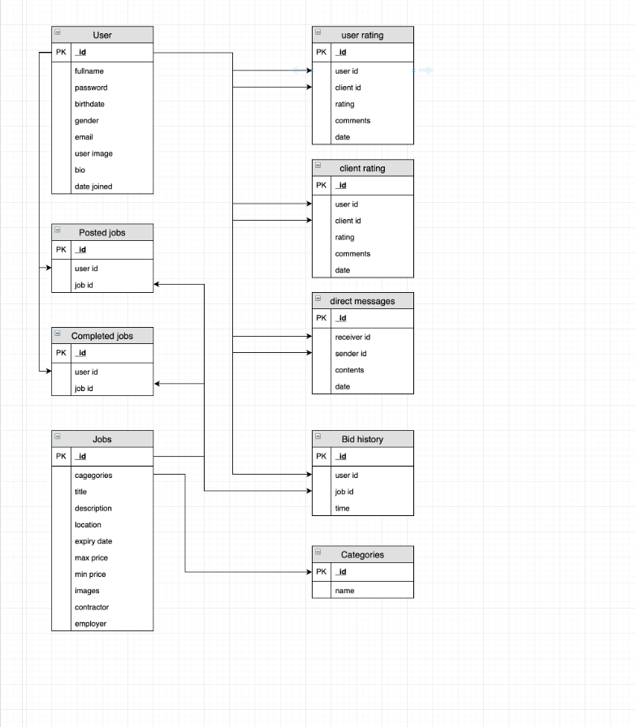
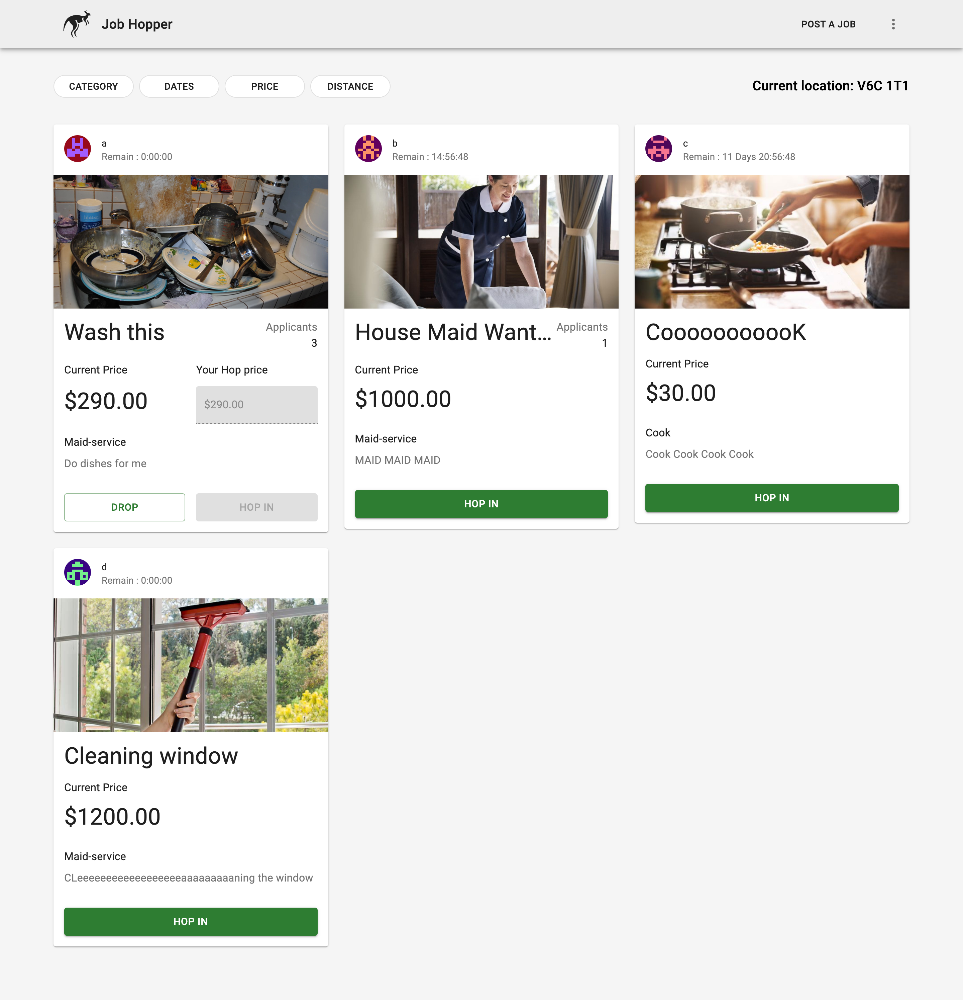
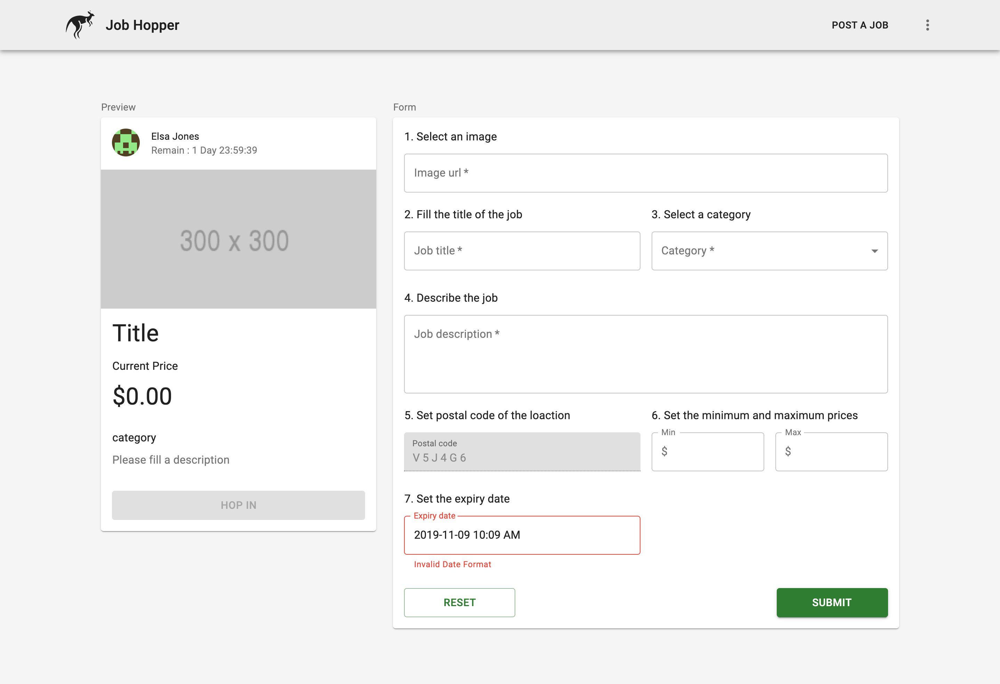
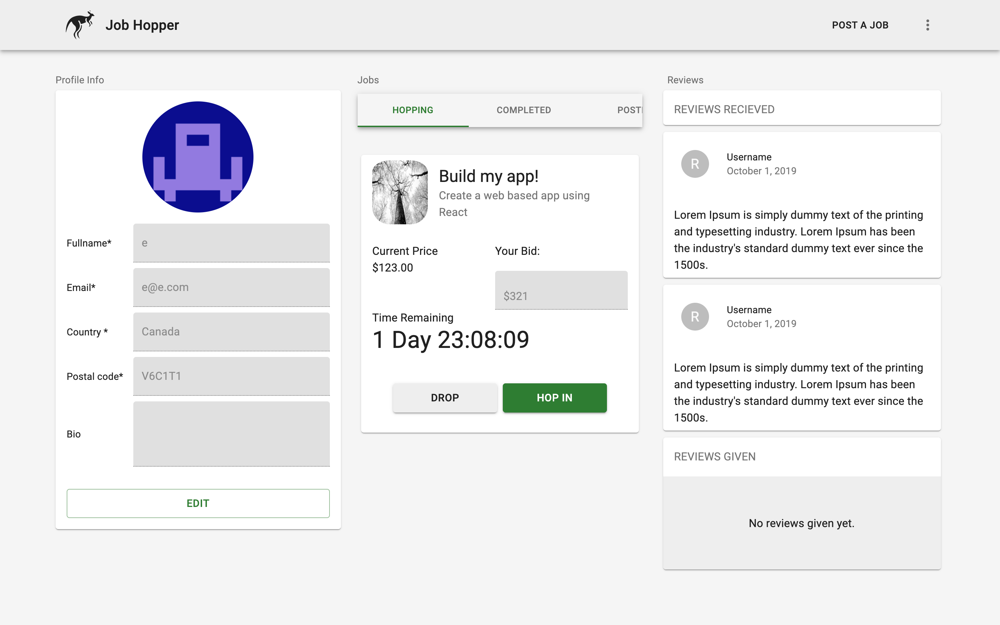

# JobHopper

- JobHopper is an auction app that offers all new jobs posted with an option to Hop In for the job the user is interested in, and gives the user a chance to Hop again if the user isn't winning the bid.
- It gives the users the ability to Login or Signup and view the available jobs in various categories.
- It also gives the privilidge to the client to post their job and its details on the app.
- The user can view his/her profile and can also edit the details if required.

## Technologies Used

- Meteor
- React
- Final Forms
- React Router
- NPM
- Mongo Database
- Material UI

## Physical Data Model

## Installation Instructions

- 'yarn install'
  Will install all dependencies required for the app.

- 'yarn run:dev'
  Runs the app in the development mode.
  Open http://localhost:3000 to view it in the browser.

The page will reload if you make edits.
You will also see any lint errors in the console.

## User Interface of JobHopper App

